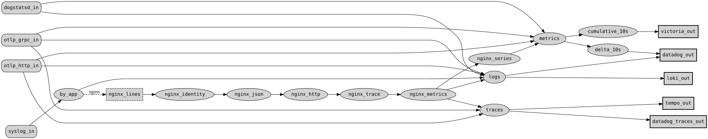

# Examples

Complete `logit` configs to start from, one directory each. Each directory holds a `logit.yaml`,
the `graph.svg` drawn from it, and any script the config loads.

Point every producer at `logit` once, and choose backends in one file. Moving a signal to another
backend later is an edit to `logit.yaml`, not a change to every application and host.

| Example | Receives | Sends to |
|---|---|---|
| [canonical](canonical/logit.yaml) ([graph](canonical/graph.svg)) | DogStatsD, syslog (with an nginx access-log branch), OTLP over gRPC and HTTP | Datadog, VictoriaMetrics, Loki, Tempo |
| [lua](lua/logit.yaml) ([graph](lua/graph.svg), [script](lua/process.lua)) | An application's logfmt request log over syslog, processed by a Lua script | A syslog alert receiver, a syslog archive, and per-route metrics on stdout |



## Validate

`logit validate` checks a config without starting anything. Set every variable the config reads
with `!env`:

```sh
DD_API_KEY=... logit validate examples/canonical/logit.yaml
logit validate examples/lua/logit.yaml
```

`logit validate` checks the graph but doesn't load a `lua_file` script. `logit run` loads it and
fails at startup if it doesn't compile.

Or use the release image, whose entrypoint is `logit`:

```sh
docker run --rm -e DD_API_KEY=x -v "$PWD/examples:/examples:ro" \
    ghcr.io/ross/logit:latest validate /examples/canonical/logit.yaml
```

## Draw the graph

```sh
logit graph logit.yaml | dot -Tsvg > graph.svg
```

`logit graph` resolves every `!env` reference too, so set the same variables as for `validate`.

## Other configs in this repo

- [`../fixtures/`](../fixtures): small configs, one per component, for contributors and the dev
  stack.
- [`../demo/`](../demo): a runnable stack. Start it with `docker compose up`.
- [`../docs/deploying.md`](../docs/deploying.md): the operator reference.
